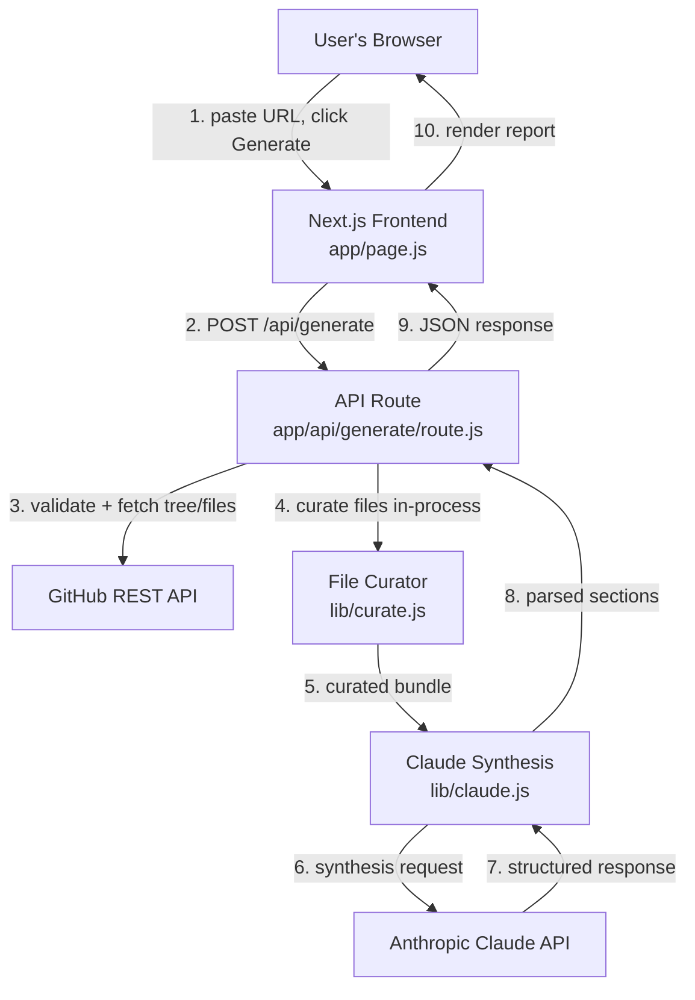
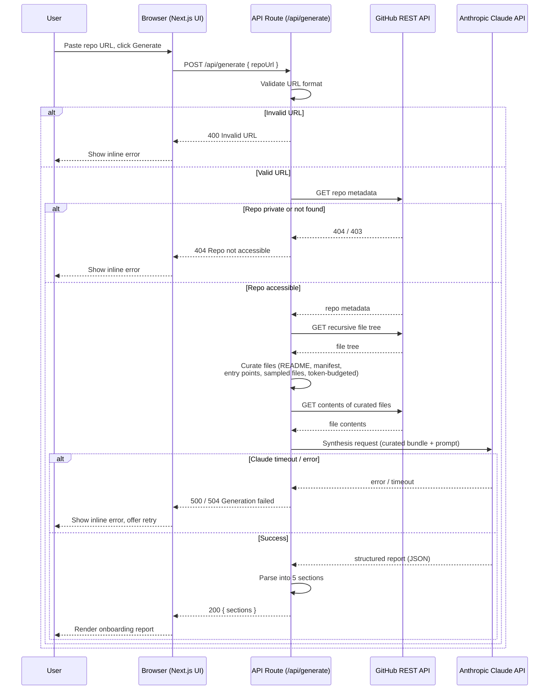

# CodeMap — Architecture

Companion to `docs/CodeMap_PRD.docx`. This document finalizes the tech stack and the system architecture for v1.0. No implementation happens today — this is the blueprint Day 4 onward builds against.

---

## 1. Tech Stack

| Layer | Choice | Why |
|---|---|---|
| Frontend | **Next.js 14 (App Router), plain JavaScript** | One framework serves both the UI and the backend API routes — no separate frontend/backend repos or deployments to manage on a solo, 30–40 hour budget. Plain JS (not TypeScript) removes a learning-curve tax we don't have time to pay this sprint; TypeScript is a clean post-capstone upgrade (see roadmap). |
| Backend | **Next.js API Routes** (serverless functions) | Ships inside the same project as the frontend. Zero extra hosting to configure. |
| Styling | **Tailwind CSS** | Fast to write, no separate design system to build from scratch, plays well with Next.js out of the box. |
| AI Model / API | **Anthropic Claude API — model `claude-sonnet-5`**, via the official `@anthropic-ai/sdk` | Current-generation Claude model, 1M-token context window (far more headroom than this project needs), official SDK handles auth headers and errors cleanly instead of hand-rolling `fetch` calls. |
| Repository data | **GitHub REST API v3** via native `fetch` (no SDK) | We only need three call shapes (repo metadata, file tree, file contents) — a full SDK like Octokit is more dependency than the job requires. |
| Database | **None in v1.0** | See `SCHEMA.md` — every v1.0 user story is satisfied by a single stateless request/response. |
| Authentication | **None in v1.0** | No accounts, no login, per NFR4. Public repos only. |
| Hosting | **Vercel — Hobby (free) tier, with Fluid Compute enabled** | Zero-config Next.js deploys, free custom domain + HTTPS, GitHub integration for auto-deploy on push. Fluid Compute (still free on Hobby) raises the serverless function timeout ceiling to 300 seconds — critical, since default Hobby functions cut off at 10 seconds and our pipeline targets ~90. |
| Version control / CI | **GitHub + Vercel's Git integration** | Push to `main` → auto-deploy. No separate CI pipeline needed for a project this size. |
| Other libraries | `react-markdown` (render report content), `zod` (lightweight request validation) | Both are small, well-maintained, and solve one specific problem each rather than pulling in a larger framework. |

**Free-tier reality check:** Vercel Hobby, the GitHub REST API (60 req/hr unauthenticated, 5,000/hr with a personal access token), and Claude API credits are all sufficient for a demo-scale portfolio project. Nothing in this stack requires a paid plan to ship or to grade.

---

## 2. System Architecture

### 2.1 Component Diagram

### 2.2 Data Flow / Request Lifecycle

### 2.3 AI Interaction

- **One synthesis call per request.** Per NFR3 (cost efficiency), the curated file bundle and the full prompt are sent to Claude in a single request — no multi-turn back-and-forth in v1.0.
- **Structured JSON output, not freeform markdown.** The prompt instructs Claude to return a strict JSON object with five fixed keys: `projectOverview`, `techStack`, `folderStructure`, `whereToStart`, `setupInstructions`. This makes FR8 (parsing the response) deterministic instead of relying on fragile markdown-header matching.
- **Groundedness instruction (NFR6).** The prompt explicitly tells Claude: only describe what is present in the provided files; if something can't be determined from the given context, say so directly rather than guessing.
- **Token budget is a design choice, not a model limit.** `claude-sonnet-5` supports a 1M-token context window — far beyond what any curated bundle here will need. The budget we enforce (see `lib/curate.js` in `PROJECT-STRUCTURE.md`) exists to control **cost and latency**, not because the model can't handle more.

### 2.4 External Services

| Service | Used for | Notes |
|---|---|---|
| GitHub REST API | Repo metadata, recursive file tree, file contents | `GET /repos/{owner}/{repo}`, `GET /repos/{owner}/{repo}/git/trees/{sha}?recursive=1`, and either `GET /repos/{owner}/{repo}/contents/{path}` or `raw.githubusercontent.com` for raw file bytes. Authenticated via personal access token (5,000 req/hr) — see Sprint Workbook, Day 3. |
| Anthropic Claude API | Report synthesis | Model `claude-sonnet-5`, single request per repo generation. |
| Vercel | Hosting, serverless functions, CI/CD | Fluid Compute enabled; `maxDuration` set to 120s as safety margin above the ~90s target. |

---

*Last updated: Day 2 of the CodeMap capstone sprint.*
