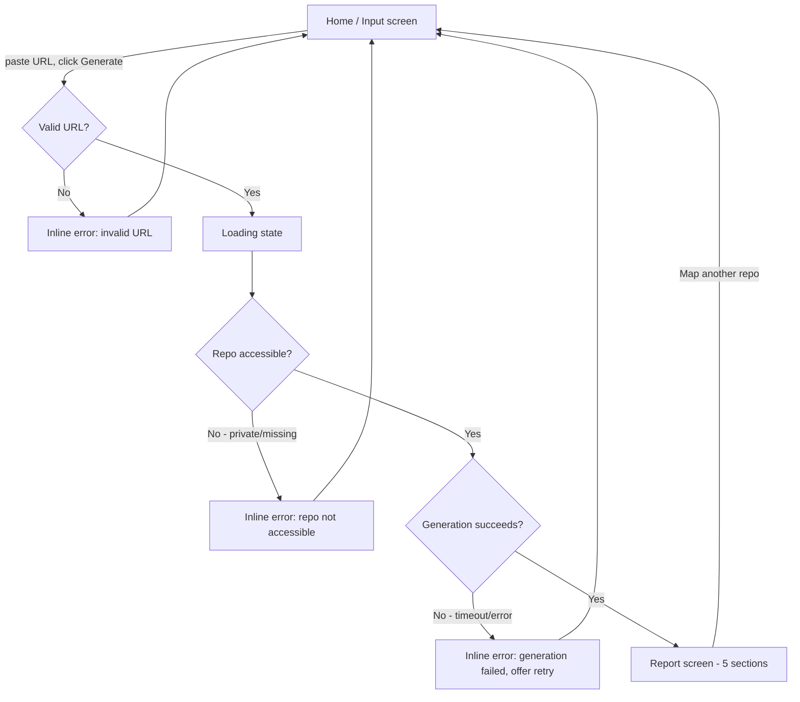

# CodeMap — UI & User Flow

## User Flow Diagram



This is a deliberately small flow: **four states** (Input, Loading, Report, Error) and **one real decision point** for the user (paste a link). That matches the PRD's core loop exactly — no extra screens have snuck in.

---

## Screen Flow & Navigation

CodeMap is a **single page** app. There is no multi-page navigation menu, because there's nothing to navigate to — the whole product is one focused task. State changes happen in place on the same screen:

1. **Input** — default state on page load.
2. **Loading** — shown after clicking Generate, replaces the input area.
3. **Report** — shown on success; includes a "Map another repo" action that returns to Input.
4. **Error** — an inline banner shown over the Input state (not a separate screen) on any failure.

No navbar, no routing, no logins. This is intentional — every extra screen is a screen someone has to build, test, and maintain, and none of them are justified by a v1.0 user story.

---

## Low-Fidelity Wireframes

### 1. Input (default state)

```
┌──────────────────────────────────────────────────────────┐
│  CodeMap                                                  │
│  Understand any repo before you open it.                  │
│                                                             │
│  ┌───────────────────────────────────────┐  ┌───────────┐ │
│  │ https://github.com/owner/repo         │  │ Generate  │ │
│  └───────────────────────────────────────┘  └───────────┘ │
│                                                             │
│  Works with public JavaScript & Python repositories.       │
└──────────────────────────────────────────────────────────┘
```

### 2. Loading

```
┌──────────────────────────────────────────────────────────┐
│  CodeMap                                                  │
│                                                             │
│  ┌───────────────────────────────────────┐  ┌───────────┐ │
│  │ https://github.com/owner/repo         │  │ Generating│ │
│  └───────────────────────────────────────┘  │  ...      │ │
│                                              └───────────┘ │
│  ⏳ Reading the repository and writing your map            │
│     (usually under 90 seconds)                             │
└──────────────────────────────────────────────────────────┘
```

### 3. Report (success state)

```
┌──────────────────────────────────────────────────────────┐
│  CodeMap                              [ Map another repo ]│
│  owner/repo · JavaScript                                   │
│                                                             │
│  ▸ Project Overview                                        │
│    ...                                                     │
│                                                             │
│  ▸ Tech Stack                                               │
│    ...                                                     │
│                                                             │
│  ▸ Folder Structure Explained                               │
│    ...                                                     │
│                                                             │
│  ▸ Where to Start Reading                                    │
│    ...                                                     │
│                                                             │
│  ▸ Setup Instructions                                       │
│    ...                                                     │
└──────────────────────────────────────────────────────────┘
```

### 4. Error (inline banner over Input)

```
┌──────────────────────────────────────────────────────────┐
│  CodeMap                                                  │
│                                                             │
│  ⚠ We can't reach that repository.                         │
│    Make sure it's public and the link is correct.          │
│                                                             │
│  ┌───────────────────────────────────────┐  ┌───────────┐ │
│  │ https://github.com/owner/repo         │  │ Generate  │ │
│  └───────────────────────────────────────┘  └───────────┘ │
└──────────────────────────────────────────────────────────┘
```

---

## Why every screen exists

- **Input** — the entire point of entry; required.
- **Loading** — required by NFR1/FR10; without it, a ~90-second wait with no feedback would look broken.
- **Report** — the actual product; required.
- **Error** — required by FR9; every failure mode from `API.md` needs somewhere to surface to the user.

No screen exists "because it might be nice" — each maps directly to a functional requirement.

---

*Last updated: Day 2 of the CodeMap capstone sprint.*
